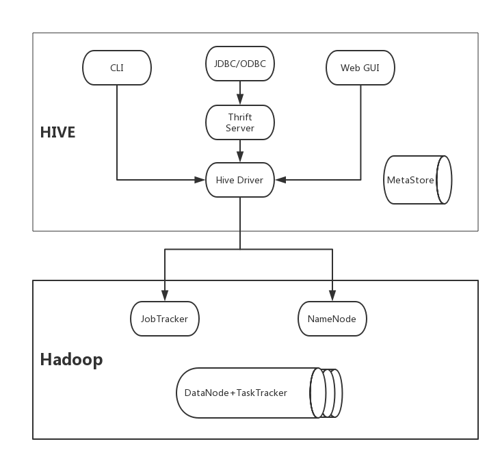

# 简介
Hive 是Hadoop生态圈的数据仓库软件，使用类似于SQL的语言读、写、管理分布式存储上的大数据集。它建立在Hadoop之上。具有以下功能和特点：     
* 通过HiveQL方便的访问数据，适合执行ETL、报表查询、数据分析等数据仓库任务。
* 直接访问HDFS的文件，或者访问如Hbase的其他数据存储。
* 可以通过MapReduce、Spark或Tez等多种计算框架执行查询。

# Hive体系结构



如图，Hive建立在Hadoop分布式文件系统(HDFS)和MapReduce之上。在Hadoop1中，Hive查询被转化为MapReduce作业，并通过JobTracker和TaskTracker执行。在Hadoop2中，YARN将资源管理和调度从MapReduce框架中解耦。Hive查询仍然被转化为MapReduce代码并执行，但使用的是YARN框架，和第二版的MapReduce。    
在HDFS和MapReduce之上，图中显示了Hive驱动程序和元数据存储。Hive驱动程序及其编译器负责编译、优化和执行`HiveQL`。依赖于具体情况，Hive Driver可能选择在本地执行Hive语句或命令，也可能是产生一个MapReduce作业。Hive Driver把元数据存储在数据库中。     
默认配置下，Hive在内建的Derby关系数据库中存储元数据，这种方式呗称为嵌入模式。在这种模式下，HiveDriver、元数据存储和Derby全部运行在同一个Java进程中。这种配置适合于学习目的，它只支持一个单一的Hive会话，所以不能用于多用户的生产环境。Hive还允许将元数据存储于本地或远程的外部数据库中，这种设置可以更好的支持Hive的多会话生产环境。并且，可以配置任何与JDBC API兼容的关系数据库系统存储元数据，如MySQL、Oracle等。   
Hive Thrift允许应用通过`JDBC/ODBC`访问Hive。    

# Hive工作流程


# Hive服务端
**HiveServer与HiveServer2**

# Hive客户端

## Beeline 命令
beeline 是为与HiveServer2服务器进行交互而开发的新命令行工具。Hive建议使用新的Beeline代替老板本的Hive CLI客户端。

```bash
# 启动beeline
> beeline
Beeline version 1.1.0-cdh5.14.2 by Apache Hive

# 连接 cdh2 上的hive
beeline> !connect jdbc:hive2://cdh2:10000
scan complete in 2ms
Connecting to jdbc:hive2://cdh2:10000
Enter username for jdbc:hive2://cdh2:10000: 
Enter password for jdbc:hive2://cdh2:10000: 
Connected to: Apache Hive (version 1.1.0-cdh5.14.2)
Driver: Hive JDBC (version 1.1.0-cdh5.14.2)
Transaction isolation: TRANSACTION_REPEATABLE_READ
0: jdbc:hive2://yoyo231:10000>

# 显示所有数据库
0: jdbc:hive2://yoyo231:10000> show databases;
+----------------+--+
| database_name  |
+----------------+--+
| default        |
| test           |
+----------------+--+
2 rows selected (0.328 seconds)


```

# Hive 优化

# 官方使用文档
https://cwiki.apache.org/confluence/display/Hive/LanguageManual       
http://www.hplsql.org/doc      
