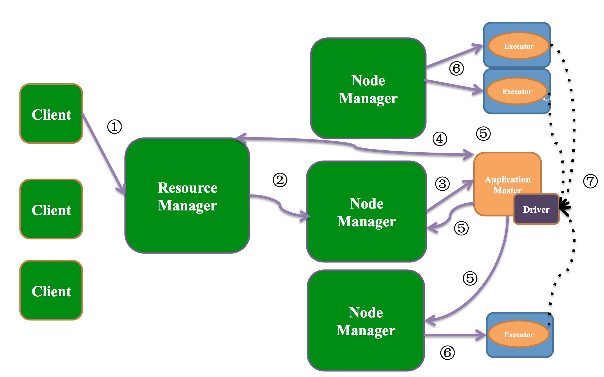

# RDD（Resilient Distributed Dataset）概念及编程模型
Spark的核心概念是 Resilient Distributed Dataset（弹性分布式数据集）。即一个可并行操作，有容错机制的分布式数据集。    
* 分布在集群中的只读对象集合（由多个partition构成）
* 可以存储在磁盘或内存中（多种存储级别）
* 可并行操作
* 失效后自动重构

## 创建RDD
有两种方法创建RDD：
* 在driver中,parallelizing一个已存在的集合：    
```java
val data = Array(1, 2, 3, 4, 5)
// sc = SparkContext()
val distData = sc.parallelize(data)
```

* 在外部系统中引用一个数据集：  

```java
// 可以使用SparkContext的textFile来创建一个文本文件的RDD
// 此方法需要一个文件的URI（计算机上的本地路径，hdfs://等等）
// spark读取这些文件，作为一个lines（行）的集合。
scala> val distFile = sc.textFile("data.txt")
distFile: org.apache.spark.rdd.RDD[String] = data.txt MapPartitionsRDD[10] at textFile at <console>:26
```

## 操作RDD
RDD支持两种类型的操作：transformations（转换） 和 actions（动作）。
* transformations： 在一个已存在的 dataset 上创建一个新的 dataset
* actions：将在 dataset 上运行的计算结果返回到driver

Spark中每个transformations都不会立即计算，只是记录应用于RDD的转换操作。只有当需要返回结果给driver时，才会进行计算（由action触发）。这种设计使Spark的运行更高效。     
默认情况下，每次在一个RDD运行一个action时，所有的transformation都会被重新计算。但是，可以使用persist或cache方法将RDD缓存到内存或持久化到磁盘中。

http://spark.apache.org/docs/latest/api/scala/index.html#org.apache.spark.rdd.RDD     
http://spark.apache.org/docs/latest/api/scala/index.html#org.apache.spark.rdd.PairRDDFunctions   

### transformations

一些常用的 transformation：

| Transformation (转换) | Meaning (含义)     |
| :------------- | :------------- |
| map(func)       | 返回一个新的 distributed dataset（分布式数据集），它由每个 source（数据源）中的元素应用一个函数 func 来生成。       |
| filter(func)    | 返回一个新的 distributed dataset（分布式数据集），它由每个 source（数据源）中应用一个函数 func 且返回值为 true 的元素来生成。|
| flatMap(func)   | 与 map 类似，但是每一个输入的 item 可以被映射成 0 个或多个输出的 items（所以 func 应该返回一个 Seq 而不是一个单独的 item）|
| mapPartitionsWithIndex(func) | 与 mapPartitions 类似，但是也需要提供一个代表 partition 的 index（索引）的 interger value（整型值）作为参数的 func，所以在一个类型为 T 的 RDD 上运行时 func 必须是 (Int, Iterator<T>) => Iterator<U> 类型。|
| sample(withReplacement, fraction, seed) | 样本数据，设置是否放回（withReplacement）、采样的百分比（fraction）、使用指定的随机数生成器的种子（seed）。|
| union(otherDataset)   | 返回一个新的 dataset，它包含了 source dataset（源数据集）和 otherDataset（其它数据集）的并集。|
| intersection(otherDataset)  | 返回一个新的 RDD，它包含了 source dataset（源数据集）和 otherDataset（其它数据集）的交集。|
| distinct([numTasks]))   | 返回一个新的 dataset，它包含了 source dataset（源数据集）中去重的元素。 |
| groupByKey([numTasks])  | 在一个 (K, V) pair 的 dataset 上调用时，返回一个 (K, Iterable<V>) pairs 的 dataset。        注意 : 如果分组是为了在每一个 key 上执行聚合操作（例如，sum 或 average)，此时使用 reduceByKey 或 aggregateByKey 来计算性能会更好。
注意 : 默认情况下，并行度取决于父 RDD 的分区数。可以传递一个可选的 numTasks 参数来设置不同的任务数。 |
| reduceByKey(func, [numTasks])	 | 在一个 (K, V) pair 的 dataset 上调用时，返回一个 (K, Iterable<V>) pairs 的 dataset，它的值会针对每一个 key 使用指定的 reduce 函数 func 来聚合，它必须为 (V,V) => V 类型。像 groupByKey 一样，可通过第二个可选参数来配置 reduce 任务的数量。|
| aggregateByKey(zeroValue)(seqOp, combOp, [numTasks])  | 在一个 (K, V) pair 的 dataset 上调用时，返回一个 (K, Iterable<V>) pairs 的 dataset，它的值会针对每一个 key 使用指定的 combine 函数和一个中间的 “zero” 值来聚合，它必须为 (V,V) => V 类型。为了避免不必要的配置，可以使用一个不同与 input value 类型的 aggregated value 类型。|
| sortByKey([ascending], [numTasks]) | 在一个 (K, V) pair 的 dataset 上调用时，其中的 K 实现了 Ordered，返回一个按 keys 升序或降序的 (K, V) pairs 的 dataset。|
| join(otherDataset, [numTasks])| 在一个 (K, V) 和 (K, W) 类型的 dataset 上调用时，返回一个 (K, (V, W)) pairs 的 dataset，它拥有每个 key 中所有的元素对。Outer joins 可以通过 leftOuterJoin，rightOuterJoin 和fullOuterJoin 来实现。|
| cogroup(otherDataset, [numTasks]) | 在一个 (K, V) 和的 dataset 上调用时，返回一个 (K, (Iterable<V>, Iterable<W>)) tuples 的 dataset。这个操作也调用了 groupWith。|
| cartesian(otherDataset) | 	在一个 T 和 U 类型的 dataset 上调用时，返回一个 (T, U) pairs 类型的 dataset（所有元素的 pairs，即笛卡尔积）。|
| pipe(command, [envVars]) | 通过使用 shell 命令来将每个 RDD 的分区给 Pipe。例如，一个 Perl 或 bash 脚本。RDD 的元素会被写入进程的标准输入（stdin），并且 lines（行）输出到它的标准输出（stdout）被作为一个字符串型 RDD 的 string 返回。|
| coalesce(numPartitions) | Decrease（降低）RDD 中 partitions（分区）的数量为 numPartitions。对于执行过滤后一个大的 dataset 操作是更有效的。|
| repartition(numPartitions) | Reshuffle（重新洗牌）RDD 中的数据以创建或者更多的 partitions（分区）并将每个分区中的数据尽量保持均匀。该操作总是通过网络来 shuffles 所有的数据。 |
| repartitionAndSortWithinPartitions(partitioner) | 根据给定的 partitioner（分区器）对 RDD 进行重新分区，并在每个结果分区中，按照 key 值对记录排序。这比每一个分区中先调用 repartition 然后再 sorting（排序）效率更高，因为它可以将排序过程推送到 shuffle 操作的机器上进行。|

### actions
一些常用的action：    

| Action | Meaning     |
| :------------- | :-------------
| reduce(func: (T, T) => T)) | 使用函数 func 聚合数据集（dataset）中的元素，这个函数 func 输入为两个元素，返回为一个元素。这个函数应该是可交换（commutative ）和关联（associative）的，这样才能保证它可以被并行地正确计算。  |
| collect()  | 在驱动程序中，以一个数组的形式返回数据集的所有元素。这在返回足够小（sufficiently small）的数据子集的过滤器（filter）或其他操作（other operation）之后通常是有用的。|
| count() | 返回数据集中元素的个数。 |
| first() | 返回数据集中的第一个元素（类似于 take(1)）。 |
| take(n) | 将数据集中的前 n 个元素作为一个数组返回。 |
| takeSample(withReplacement, num, [seed])  |  对一个数据集随机抽样，返回一个包含 num 个随机抽样（random sample）元素的数组，参数 withReplacement 指定是否有放回抽样，参数 seed 指定生成随机数的种子。 |
| takeOrdered(n, [ordering])  |  返回 RDD 按自然顺序（natural order）或自定义比较器（custom comparator）排序后的前 n 个元素。  |
| saveAsTextFile(path)  |  将数据集中的元素以文本文件（或文本文件集合）的形式写入本地文件系统、HDFS 或其它 Hadoop 支持的文件系统中的给定目录中。Spark 将对每个元素调用 toString 方法，将数据元素转换为文本文件中的一行记录。 |
| saveAsSequenceFile(path) (Java and Scala)  | 将数据集中的元素以 Hadoop SequenceFile 的形式写入到本地文件系统、HDFS 或其它 Hadoop 支持的文件系统指定的路径中。该操作可以在实现了 Hadoop 的 Writable 接口的键值对（key-value pairs）的 RDD 上使用。在 Scala 中，它还可以隐式转换为 Writable 的类型（Spark 包括了基本类型的转换，例如 Int、Double、String 等等)。 |
| saveAsObjectFile(path) (Java and Scala)  | 使用 Java 序列化（serialization）以简单的格式（simple format）编写数据集的元素，然后使用 SparkContext.objectFile() 进行加载。 |
| countByKey() | 仅适用于（K,V）类型的 RDD 。返回具有每个 key 的计数的 （K , Int）对 的 hashmap。 |
| foreach(func) | 对数据集中每个元素运行函数 func 。这通常用于副作用（side effects），例如更新一个累加器（Accumulator）或与外部存储系统（external storage systems）进行交互。注意：修改除 foreach() 之外的累加器以外的变量（variables）可能会导致未定义的行为（undefined behavior）。|

### Shuffle 操作
Spark里的某些操作会触发Shuffle。Shuffle 是Spark重新分配数据的一种机制，使得这些数据可以跨不同的区域进行分组。这通常涉及executors和机器之间拷贝数据，使得Shuffle成为复杂的，高代价的操作。

http://www.apache.wiki/pages/viewpage.action?pageId=2886208

# Spark 程序运行机制
  
Spark应用在集群上以独立的进程组来运行，在main程序中通过SparkContext来驱动（称之为driver程序）。
1. 为了运行在集群上，SparkContext首先与Cluster Manager通信，Cluster Manager会分配应用相应的资源。
    1. Spark 自己的 Standlone Cluster Manager
    2. Mesos
    3. Yarn
2. Cluster Manager为Spark分配好资源节点（Work Node），SparkContext与Work Node中的Executor通信，这些Executor进程可以运行计算并且为Spark应用存储数据。
3. SparkContext发送代码（通过 JAR 或者 Python 文件定义传递给 SparkContext）至Executor。
4. 最终SparkContext将发送Task至Executor。

Spark On Yarn


1. 在一个独立节点上启动一个Spark应用（spark-submit），SparkContext 与ResourceManager通信，申请资源。
2. ResourceManager选取一个Node，与该Node的NodeManager通信。
3. Node Manager启动该Spark应用对应的Application Master。
4. Application Master与ResourceManager通信，为Executors申请资源。
5. ResourceManager选取指定Node，并与指定的Node Manager通信，启动Executor并为其分配资源。
6. Application Master与Executor通信。
7. Executor与SparkContext（driver）通信，领取Task。

# References
* [Apache Spark Space （Apache Wiki） ](http://www.apache.wiki/pages/viewpage.action?pageId=2883610)
* [Spark编程指南-简体中文版（GitBook）](https://www.gitbook.com/book/aiyanbo/spark-programming-guide-zh-cn/details)    
