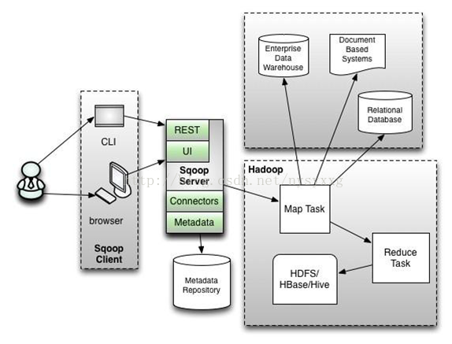

# Sqoop简介
Sqoop是一个在Hadoop与结构化数据存储（例如关系数据库）之间高效传输大批量数据的工具。   
Sqoop有Sqoop1和Sqoop2两个大版本，Sqoop1与Sqoop2并不兼容。而且到目前为止Sqoop2并不完善，不推荐在生产环境中部署。    
Sqoop1与Sqoop2架构分别如图：     

Sqoop1架构图：   
     

Sqoop2架构图：    


由上图可知，Sqoop1基于客户端模型，需要在客户端安装配置，并且只有Map任务。同时，Sqoop1还可以使用Oozie调度和管理作业。Sqoop1是用Java开发的，完全客户端驱动，严重依赖JDBC，使用命令行导入导出数据。Sqoop1的主要问题包括：繁多的命令行参数；不安全的连接方式，如直接在命令行写密码等；没有元数据存储，只能本地配置和管理，使复用收到限制。    

而Sqoop2体系结构比Sqoop1复杂得多，它被设计解决Sqoop1的问题，主要体现在易用性、可扩展性和安全性三个方面。    
1. 易用性
    Sqoop1需要客户端安装和配置，而Sqoop2是在服务器端安装和配置。这意味着连接器只在一个地方统一配置，由管理员角色管理，操作员角色使用。Sqoop2还有一个基于Web的服务。

2. 可扩展性
    在Sqoop2中，连接器不在受限与JDBC的SQL语法，如不必指定database、table等，甚至可以定义自己的SQL方言。

3. 安全性
    Sqoop1用户是通过执行sqoop命令运行Sqoop，Sqoop作业的安全性主要由是否对Sqoop的用户信任所决定。Sqoop2将作为基于应用的服务，通过按不同角色链接对象，支持对外部系统的安全访问。为了进一步安全，Sqoop不再允许生成代码、请求直接访问Hive或Hbase，也不对运行的作业开放访问所有客户端的权限。


# Sqoop命令
```bash
# 查看帮助
> sqoop help  
18/07/03 14:26:36 INFO sqoop.Sqoop: Running Sqoop version: 1.4.6-cdh5.14.2
usage: sqoop COMMAND [ARGS]

Available commands:
  codegen            Generate code to interact with database records
  create-hive-table  Import a table definition into Hive
  eval               Evaluate a SQL statement and display the results
  export             Export an HDFS directory to a database table
  help               List available commands
  import             Import a table from a database to HDFS
  import-all-tables  Import tables from a database to HDFS
  import-mainframe   Import datasets from a mainframe server to HDFS
  job                Work with saved jobs
  list-databases     List available databases on a server
  list-tables        List available tables in a database
  merge              Merge results of incremental imports
  metastore          Run a standalone Sqoop metastore
  version            Display version information

# 查看 import命令参数
> sqoop import --help

# 一次从mysql导入数据到hive示例
> sqoop import --connect jdbc:mysql://192.168.1.233:3306/logdb \
> --username root \
> --password 123456 \
> --table SYSMENU 
> --hive-import \
> --create-hive-table \
> --hive-table test.sysmenu
```

# Sqoop优化
