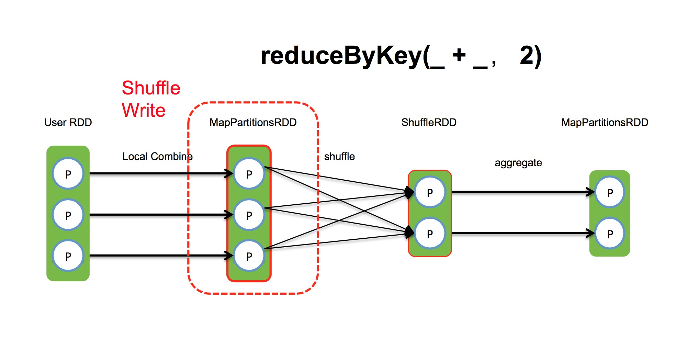

# 核心概念

## Job
Spark中每个Action操作生成一个Job，由多个stage组成。

## Stage
每个shuffle操作分割出一个stage，由多个并行task组成。

## executor
task执行容器，可由提交任务时设置。默认两个。

## task
最初task数量与数据源中的partition数量相同。如hdfs中的block（默认每个block为128M）数，hbase中的region数。    
后续操作的task数量默认与parent task相同，可以在引起shuffle的transformation/action中设置（partitionNum）。

# Spark引擎内部执行流程
1. 生成逻辑查询计划 （RDD逻辑依赖关系）
2. 生成物理查询计划 （根据shuffle操作划分stage）
3. 任务调度         
4. 任务执行

其中，前三步是在Driver端完成。第四个阶段在Executor中完成。

# Shuffle
在做reduce操作时，新的RDD中的每个partition不完全依赖于前面RDD的某个partition。也就是说需要从前面RDD中的多个partition中的数据进行计算生成。    
Shuffle操作会引起多个节点之间跨网络的传输数据，往往会是一个计算的瓶颈。

