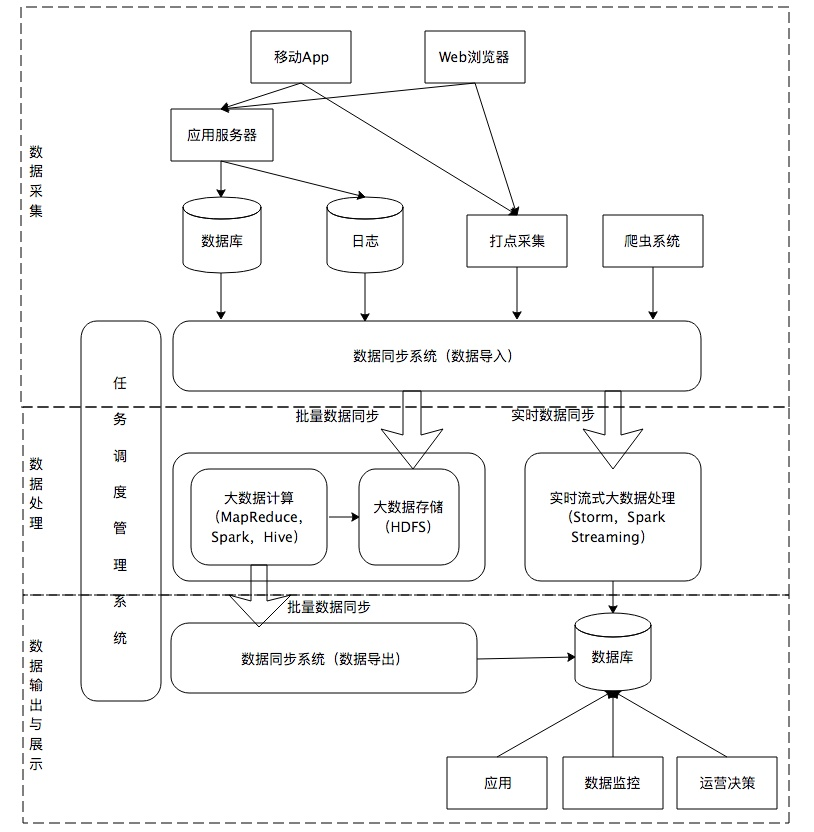

# 大数据平台简介
https://zhuanlan.zhihu.com/p/36082771     

  

如上图，大数据平台可分为三个部分： 数据采集、数据处理、数据输出与展示。

# 数据采集
数据的入口：  
* 数据库
* 日志系统
* 爬虫
* 打点采集  

不同的数据来源需要采用不同的方式来采集：
* 数据库可采用`Sqoop`、阿里开源的`canal`+`otter`(基于Binlog方式)
* 日志可采用`Flume`
* 爬虫与打点数据经过`格式化转换`后可采用`kafka`

不同来源的数据数据质量不同，质量低的数据需要进行清洗，如爬虫数据和日志数据。所以，数据采集系统也承担着传统数据仓库`ETL`的角色。

## Sqoop

## Flumn

## Kafka

# 数据处理
采用Spark、MapReduce、Hive等计算框架从HDFS上读取数据，进行计算，再将结果写入HDFS或RDB。

## 实时（real time）
Storm、Spark Streaming针对增量数据进行处理

## 离线
Spark、MapReduce、Hive 针对全量数据

# 数据输出与展示

## Hue

## 

# 工作流工具

## Oozie

## 