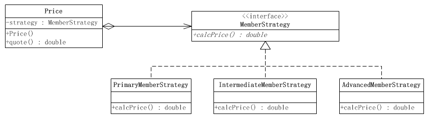

# 策略模式
针对一个行为，有多种实现方式(算法)，可以将算法抽象出一个借口，每种算法实现继承自该接口，调用者(算法 环境/上下文)根据 自身条件/需求 选择合适的算法实现。

使得算法的实现对调用者透明，算法可方便扩展，也符合了 开-闭原则(对扩展开放，对修改关闭)。

## 策略模式结构


* Context(环境/上下文)：持有一个Strategy引用
* Strategy(抽象策略接口)：定义了算法的抽象，所有算法实现继承于此
* ConcreteStrategy(具体策略)：算法的实现

### 代码框架
```java
// 策略抽象
public interface Strategy {
    // 算法接口
    void stragetyInterface();
}


// 算法实现
public class ConcreteStrategyA implements Strategy{
    @overried
    public void stragetyInterface() {
        //todo
    }
}

public class ConcreteStrategyB implements Strategy{
    @overried
    public void stragetyInterface() {
        //todo
    }
}

// 策略运行的上下文类
public class Context {
   private Strategy strategy;

   public Context(Strategy strategy) {
      this.strategy = strategy;
   }

   public void contextInterface() {
      strategy.strategyInteface();
   }
}
```

## 举例
在某个图书电商系统的结算中，根据 初级，中级，高级 会员实行不同的结算规则。



抽象折扣类
```java
public interface MemberStrategy {
    /**
     * 计算图书的价格
     * @param booksPrice    图书的原价
     * @return    计算出打折后的价格
     */
    public double calcPrice(double booksPrice);
}
```

初级会员折扣
```java
public class PrimaryMemberStrategy implements MemberStrategy {

    @Override
    public double calcPrice(double booksPrice) {

        System.out.println("对于初级会员的没有折扣");
        return booksPrice;
    }

}
```

中级会员折扣
```java
public class IntermediateMemberStrategy implements MemberStrategy {

    @Override
    public double calcPrice(double booksPrice) {

        System.out.println("对于中级会员的折扣为10%");
        return booksPrice * 0.9;
    }

}
```

高级会员折扣
```java
public class AdvancedMemberStrategy implements MemberStrategy {

    @Override
    public double calcPrice(double booksPrice) {

        System.out.println("对于高级会员的折扣为20%");
        return booksPrice * 0.8;
    }
}
```

价格类(Context)
```java
public class Price {
    //持有一个具体的策略对象
    private MemberStrategy strategy;
    /**
     * 构造函数，传入一个具体的策略对象
     * @param strategy    具体的策略对象
     */
    public Price(MemberStrategy strategy){
        this.strategy = strategy;
    }

    /**
     * 计算图书的价格
     * @param booksPrice    图书的原价
     * @return    计算出打折后的价格
     */
    public double quote(double booksPrice){
        return this.strategy.calcPrice(booksPrice);
    }
}
```

客户端
```java
public class Client {

    public static void main(String[] args) {
        //选择并创建需要使用的策略对象
        MemberStrategy strategy = new AdvancedMemberStrategy();
        //创建环境
        Price price = new Price(strategy);
        //计算价格
        double quote = price.quote(300);
        System.out.println("图书的最终价格为：" + quote);
    }

}
```

## 总结
都在心里


## 参考

[《JAVA与模式》之策略模式](http://www.cnblogs.com/java-my-life/archive/2012/05/10/2491891.html)

[ 策略模式](http://design-patterns.readthedocs.io/zh_CN/latest/behavioral_patterns/strategy.html)

[设计模式 ( 十八 ) 策略模式Strategy（对象行为型）](http://blog.csdn.net/hguisu/article/details/7558249)
