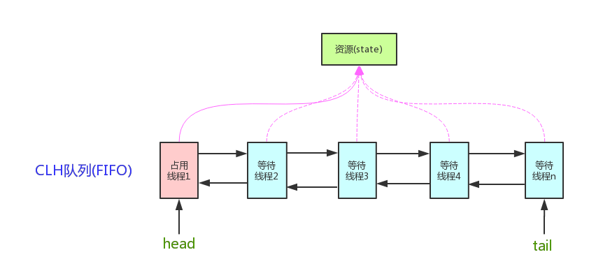

# AbstractQueuedSynchronizer(AQS) 概述
`AbstractQueuedSynchronizer`抽象队列同步器，定义了一套多线程访问共享资源的同步器框架，Java中许多同步工具类都依赖于它，如常用的`ReentrantLock/Semaphore/CountDownLatch`。

# 框架

图片来自 http://www.cnblogs.com/waterystone/p/4920797.html



`AQS`维护了一个`volatile int state`变量（代表共享资源）。和一个`FIFO`队列(CLH队列)，多线程争用资源被阻塞时会进入此队列。

`state`的三个操作： 
* `getState()`
* `setState()`
* `compareAndSetState()`

AQS定义资源有两种使用方式：Exclusive（独占，当前时刻只能一个线程运行，如ReentrantLock）和Share（共享，多个线程可同时执行，如Semaphore、CountDownLatch）。
不同的自定义同步器争用共享资源的方式也不同。**自定义同步器只要实现资源state的获取和释放即可**，至于线程等待队列的维护（线程获取资源失败后 阻塞入队、唤醒出队等）AQS已经实现好了。自定义同步器实现时主要实现以下几个方法：
1. `isHeldExclusively()`：该线程是否正在独占资源。只有用到`condition`才需要去实现它。
2. `tryAcquire(int)`：独占方式，尝试获取资源。成功返回`true`，失败返回`false`。
3. `tryRelease(int)`：独占方式，尝试释放资源。成功返回`true`，失败返回`false`。
4. `tryAcquireShared(int)`：共享方式尝试获取资源。负数表示失败。0表示成功，但没有可用资源。整数表示成功，且有剩余资源。
5. `tryReleaseShared(int)`：共享方式尝试释放资源。如果释放后允许唤醒后续等待节点返回`true`，否则返回`false`。

独占模式以`ReentrantLock`为例。`state`初始化为0。A线程`lock`时，调用`tryAcquire(1)`获取资源资源，获取成功，state值为1。此时，其他线程尝试获取资源就会失败。只有当A线程`unlock`时，调用`tryRelease(1)`释放资源。在`ReentrantLock`中，线程A可以使用`tryAcquire()`重复获取资源，当然每次`tryAcquire`必须通过一次`tryRelease`来释放。只有当`state == 0`时，其他线程才可以获取资源。

共享模式以`CountDownLatch`为例。构造方法`CountDownLatch(int count)`，初始化state为指定值count，每个业务线程在执行到指定位置时，调用`countDown()`方法释放资源，当`state`值置为`0`时，`await`线程被唤醒(unpark)。

# 源码解析

## acquire(int arg)

```java
/**
     * Acquires in exclusive mode, ignoring interrupts.  Implemented
     * by invoking at least once {@link #tryAcquire},
     * returning on success.  Otherwise the thread is queued, possibly
     * repeatedly blocking and unblocking, invoking {@link
     * #tryAcquire} until success.  This method can be used
     * to implement method {@link Lock#lock}.
     *
     * @param arg the acquire argument.  This value is conveyed to
     *        {@link #tryAcquire} but is otherwise uninterpreted and
     *        can represent anything you like.
     */
    public final void acquire(int arg) {
        if (!tryAcquire(arg) &&
            acquireQueued(addWaiter(Node.EXCLUSIVE), arg))
            selfInterrupt();
    }
```

函数流程如下：
1. `tryAcquire()` 尝试获取资源，如果成功则返回。
2. `addWaiter(Node.EXCLUSIVE)` 将该线程加入等待队列的尾部，并标记为独占模式。并返回添加的节点。
3. `acquireQueued()` 使线程在队列中获取资源，一直获取到资源后再返回。如果整个等待过程中被中断过则返回`true`，否则返回`false`。
4. `selfInterrupt()` 如果线程在等待的过程中被中断过，它是不响应的。只有获取资源后再进行自我中断`selfInterrupt()`，将中断补上。

### tryAcquire(int)
```java
protected boolean tryAcquire(int arg) {
    throw new UnsupportedOperationException();
}
```
在模板方法`acquire`中，`tryAcquire`就是由子类去实现的操作（通过state的get/set/CAS）。至于能不能重入，能不能加塞，就看自定义的同步器怎么去设计了。

这里之所以设计成`protected`而没有设计成`abstract`，是因为独占模式下只需实现`tryAcquire-tryRelease`，共享模式下只需实现`tryAcquireShared-tryReleaseShared`。如果都设计成`abstract`的，那么每个自定义同步器都需要自己去实现一遍。所以，这也减少了不必要的工作量。

### addWaiter(Node)

该方法将当前线程加入等待队列的队尾，并返回当前线程所在的节点。

```java
/**
    * Creates and enqueues node for current thread and given mode.
    *
    * @param mode Node.EXCLUSIVE for exclusive, Node.SHARED for shared
    * @return the new node
    */
private Node addWaiter(Node mode) {
    // 以给定模式创建节点，mode有两种：EXCLUSIVE（独占），SHARED（共享）
    Node node = new Node(Thread.currentThread(), mode);

    // Try the fast path of enq; backup to full enq on failure
    Node pred = tail;
    if (pred != null) {
        node.prev = pred;
        if (compareAndSetTail(pred, node)) { // 通过cas操作，快速入队至队尾
            pred.next = node;
            return node;
        }
    }
    enq(node); // 如果快速入队失败，则调用enq方法入队
    return node;
}
```

#### enq(Node)

```java
/**
* Inserts node into queue, initializing if necessary. See picture above.
* @param node the node to insert
* @return node's predecessor
*/
private Node enq(final Node node) {
    for (;;) {
        Node t = tail;
        if (t == null) { // Must initialize （如果队列为空，则初始化一个头节点，尾指针也指向它）
            if (compareAndSetHead(new Node()))
                tail = head;
        } else { // 走入队流程，当前节点将前驱指向尾节点，并cas操作将当前节点置为尾节点（尾节点指向当前节点）
            node.prev = t;
            if (compareAndSetTail(t, node)) {
                t.next = node;
                return t;
            }
        }
    }
}
```

### acquireQueued()

经过`tryAcquire`和`addWaiter`当前线程已经获取锁（资源）失败进入等待队列中了。接着就是进入等待状态休息，直到其他线程彻底释放资源后唤醒自己，自己再拿到资源，然后就可以开始自己的表演了（这个过程是不可中断的）。

```java
/**
* Acquires in exclusive uninterruptible mode for thread already in
* queue. Used by condition wait methods as well as acquire.
*
* @param node the node
* @param arg the acquire argument
* @return {@code true} if interrupted while waiting
*/
final boolean acquireQueued(final Node node, int arg) {
    boolean failed = true; // 标记是否成功拿到资源
    try {
        boolean interrupted = false; // 中断标记
        for (;;) {
            final Node p = node.predecessor(); // 前驱节点

            // 如果前驱节点是头节点，那么再次尝试获取资源
            // 进行到这一步，可能是初次入队，也可能是前驱节点释放完资源唤醒自己，也可能是被interrupt了
            if (p == head && tryAcquire(arg)) { 
                setHead(node); // 如果获取成功，表名前驱节点已经执行完毕彻底释放资源，将当前节点置为头节点
                p.next = null; // help GC
                failed = false;
                return interrupted; // 返回等待过程中是否被中断过
            }

            // shouldParkAfterFailedAcquire 检查当前线程是否应该休息
            // parkAndCheckInterrupt 当前线程休眠并检查中断状态
            if (shouldParkAfterFailedAcquire(p, node) &&
                parkAndCheckInterrupt())
                interrupted = true; // 如果当前线程曾被中断，则设置中断标记为true
        }
    } finally {
        if (failed)
            cancelAcquire(node);
    }
}
```

#### shouldParkAfterFailedAcquire(Node, Node)

```java
/**
* Checks and updates status for a node that failed to acquire.
* Returns true if thread should block. This is the main signal
* control in all acquire loops.  Requires that pred == node.prev.
*
* @param pred node's predecessor holding status
* @param node the node
* @return {@code true} if thread should block
*/          
private static boolean shouldParkAfterFailedAcquire(Node pred, Node node) {
    int ws = pred.waitStatus;  // 前驱节点的状态
    if (ws == Node.SIGNAL) // 如果状态为SIGNAL(-1)，表名前驱释放资源后会通知(unpark)自己，则可以安心休息，直接返回true
        /*
            * This node has already set status asking a release
            * to signal it, so it can safely park.
            */
        return true;
    if (ws > 0) { 
        // 如果状态大于0，则表名前驱已经放弃(CANCEL)，一直往前找，找到最近的一个未放弃的节点，排在它后面
        // 中间跳过的节点将被回收掉(GC)
        /*
            * Predecessor was cancelled. Skip over predecessors and
            * indicate retry.
            */
        do {
            node.prev = pred = pred.prev;
        } while (pred.waitStatus > 0);
        pred.next = node;
    } else { // 状态为0(未设置过等待状态)或-2时，将状态设置为SIGNAL。即 释放资源后通知下自己
        /*
            * waitStatus must be 0 or PROPAGATE.  Indicate that we
            * need a signal, but don't park yet.  Caller will need to
            * retry to make sure it cannot acquire before parking.
            */
        compareAndSetWaitStatus(pred, ws, Node.SIGNAL);
    }
    return false;
}
```
整个流程中，如果前驱不为SIGNAL，则需要跳过那些状态值大于0(CANCEL)的节点，链到状态值小于0的节点后，并将新的前驱状态值设置为SIGNAL。
总之就是保证前驱的状态为SIGNAL，才能放心的去休息。

#### parkAndCheckInterrupt()
```java
/**
* Convenience method to park and then check if interrupted
*
* @return {@code true} if interrupted
*/
private final boolean parkAndCheckInterrupt() {
    LockSupport.park(this); // 调用 park() 使线程进入waiting状态
    return Thread.interrupted(); // 如果被唤醒，则检查自己是否被中断过
}
```

`park()`会让线程进入`waiting`状态，这个状态下的线程有两种途径可以唤醒：1) 被unpark()，2) 被interrupt()。
Thread.interrupted()会检查当前的终端状态，并将中断状态清除。

## acquire(int arg) 小结
```java
/**
* Acquires in exclusive mode, ignoring interrupts.  Implemented
* by invoking at least once {@link #tryAcquire},
* returning on success.  Otherwise the thread is queued, possibly
* repeatedly blocking and unblocking, invoking {@link
* #tryAcquire} until success.  This method can be used
* to implement method {@link Lock#lock}.
*
* @param arg the acquire argument.  This value is conveyed to
*        {@link #tryAcquire} but is otherwise uninterpreted and
*        can represent anything you like.
*/
public final void acquire(int arg) {
    if (!tryAcquire(arg) &&
        acquireQueued(addWaiter(Node.EXCLUSIVE), arg))
        selfInterrupt();
}
```

再总结下`acquire`的流程：
1. 通过`tryAcquire`尝试获取资源，如果成功则直接返回
2. 如果上一步资源没有获取成功，则调用`addWaiter`将当前线程以独占模式加入等待队列尾部
3. 加入队列成功后，`acquireQueued`方法使线程找到安全点（确保前驱节点状态不为CANCEL），并设置前驱节点拿到资源后唤醒自己。调用`park`进入休眠。在被前驱节点`unpark`或被`interrupt`后再次尝试获取资源。在这个过程中如果被中断或则记录中断状态，不响应中断。
4. 如果在线程park过程中被中断过，则在获取到资源后调用`selfInterrupt`将中断补上。


## release(int arg)
该方法是释放共享资源的顶层入口。它会释放指定量的资源。
```java
/**
     * Releases in exclusive mode.  Implemented by unblocking one or
     * more threads if {@link #tryRelease} returns true.
     * This method can be used to implement method {@link Lock#unlock}.
     *
     * @param arg the release argument.  This value is conveyed to
     *        {@link #tryRelease} but is otherwise uninterpreted and
     *        can represent anything you like.
     * @return the value returned from {@link #tryRelease}
     */
    public final boolean release(int arg) {
        if (tryRelease(arg)) {
            Node h = head;
            if (h != null && h.waitStatus != 0)
                unparkSuccessor(h);
            return true;
        }
        return false;
    }
```

### tryRelease(int)
这同`tryAcquire(int)`一样是需要子类去实现的方法。`release(int)`通过`tryRelease(int)`的返回结果来判断资源是否成功释放。在自定义同步器时，如果资源已经彻底释放掉(state == 0)则返回`true`，否则(state != 0)返回false。

```java
protected boolean tryRelease(int arg) {
    throw new UnsupportedOperationException();
}
```

### unparkSuccessor(Node)
```java
/**
     * Wakes up node's successor, if one exists.
     *
     * @param node the node
     */
    private void unparkSuccessor(Node node) {
        /*
         * If status is negative (i.e., possibly needing signal) try
         * to clear in anticipation of signalling.  It is OK if this
         * fails or if status is changed by waiting thread.
         */
        int ws = node.waitStatus;
        if (ws < 0) // 置零当前线程所在的节点状态
            compareAndSetWaitStatus(node, ws, 0);

        /*
         * Thread to unpark is held in successor, which is normally
         * just the next node.  But if cancelled or apparently null,
         * traverse backwards from tail to find the actual
         * non-cancelled successor.
         */
        Node s = node.next;
        if (s == null || s.waitStatus > 0) { // 如果当前节点的后继节点为空或者为已取消
            s = null;
            for (Node t = tail; t != null && t != node; t = t.prev) // 则从尾节点向前遍历找到最前面的可用节点
                if (t.waitStatus <= 0) // 等待状态 <=0 的节点都是有效节点
                    s = t;
        }
        if (s != null) 
            LockSupport.unpark(s.thread); // 唤醒该节点
    }
```

这个函数要做的就是 **唤醒最前面的那个未放弃（CANCEL）的节点**。假设该节点为s，则s被唤醒，s进入`acquireQueued`中`final Node p = node.predecessor(); p == head && tryAcquire(arg)`的判断，如果此时，s的前驱节点为head节点，则尝试获取资源。如果`p != head`则进入`shouldParkAfterFailedAcquire`的调整，s也必然会跑到`head`节点的next节点，然后自旋成功，通过`tryAcquire`成功获取到资源，并且通过`setHead()`将自己设置成head节点。`acquire`函数返回，获取资源(锁)成功，进行接下来的操作。

### unparkSuccessor的疑问
这里对于`unparkSuccessor`为何从后向前遍历有个疑问。 [Java AQS unparkSuccessor 方法中for循环从tail开始而不是head的疑问？](https://www.zhihu.com/question/50724462)

看`addWaiter(Node)`入队操作：  
```java
/**
     * Inserts node into queue, initializing if necessary. See picture above.
     * @param node the node to insert
     * @return node's predecessor
     */
    private Node enq(final Node node) {
        for (;;) {
            Node t = tail;
            if (t == null) { // Must initialize
                if (compareAndSetHead(new Node()))
                    tail = head;
            } else {
                node.prev = t;
                if (compareAndSetTail(t, node)) {
                    t.next = node;
                    return t;
                }
            }
        }
    }
```
由代码可以看出，先将新节点node.prev指向尾节点t，而通过CAS操作`compareAndSetTail(t, node)`保证了前一步的线程安全，因为CAS失败则进入下一轮循环，CAS成功后再由t.next指向新的节点。所以如果从前向后遍历的话，可能是找不到这个新节点的（t.next = node未执行）。

## acquireShared(int arg)
该方法是共享模式下获取共享资源的顶层模板方法。

```java
 /**
* Acquires in shared mode, ignoring interrupts.  Implemented by
* first invoking at least once {@link #tryAcquireShared},
* returning on success.  Otherwise the thread is queued, possibly
* repeatedly blocking and unblocking, invoking {@link
* #tryAcquireShared} until success.
*
* @param arg the acquire argument.  This value is conveyed to
*        {@link #tryAcquireShared} but is otherwise uninterpreted
*        and can represent anything you like.
*/
public final void acquireShared(int arg) {
    if (tryAcquireShared(arg) < 0) 
        doAcquireShared(arg); 
}
```

这里`tryAcquireShared`也需要由自定义同步器去实现。但是AQS已经把`tryAcquireShared`的返回值语义定义好了：
* 0：获取成功，但没有剩余资源
* 正数：获取成功，还有剩余资源，其他线程还可以继续获取
* 负数：获取失败

SO，这里`acquireShared`的获取流程是：
1. `tryAcquireShared`获取资源，成功则直接返回
2. 失败则通过`doAcquireShared`进入等待队列，直至获取资源成功返回。

### tryAcquireShared(int)
与`tryAcquire`一样，`tryAcquireShared`也被设计成由子类实现的方法。
```java
protected int tryAcquireShared(int arg) {
    throw new UnsupportedOperationException();
}
```

### doAcquireShared(int)
```java
/**
* Acquires in shared uninterruptible mode.
* @param arg the acquire argument
*/
private void doAcquireShared(int arg) {
    final Node node = addWaiter(Node.SHARED); // 加入队列尾部
    boolean failed = true; // 失败标志
    try {
        boolean interrupted = false; // 是否被中断过标志
        for (;;) {
            final Node p = node.predecessor(); // 当前节点的前驱节点（此时可能是被前驱节点unpark）
            if (p == head) { // 如果前驱节点是head节点（head节点释放资源后通知自己）
                int r = tryAcquireShared(arg); // 尝试获取资源
                if (r >= 0) { // 获取资源成功
                    setHeadAndPropagate(node, r); // 当前节点置为头节点，并根据是否有剩余资源决定唤醒后面的线程
                    p.next = null; // help GC
                    if (interrupted) // 如果被中断过，补上中断
                        selfInterrupt();
                    failed = false; 
                    return;
                }
            }

            // 1. shouldParkAfterFailedAcquire 判断是否需要休息
            // 2. parkAndCheckInterrupt park当前线程，并检查是否有中断
            if (shouldParkAfterFailedAcquire(p, node) &&
                parkAndCheckInterrupt())
                interrupted = true;
        }
    } finally {
        if (failed)
            cancelAcquire(node);
    }
}
```

>有木有觉得跟acquireQueued()很相似？对，其实流程并没有太大区别。只不过这里将补中断的selfInterrupt()放到doAcquireShared()里了，而独占模式是放到acquireQueued()之外，其实都一样，不知道Doug Lea是怎么想的。

>跟独占模式比，还有一点需要注意的是，这里只有线程是head.next时（“老二”），才会去尝试获取资源，有剩余的话还会唤醒之后的队友。那么问题就来了，假如老大用完后释放了5个资源，而老二需要6个，老三需要1个，老四需要2个。老大先唤醒老二，老二一看资源不够，他是把资源让给老三呢，还是不让？答案是否定的！老二会继续park()等待其他线程释放资源，也更不会去唤醒老三和老四了。独占模式，同一时刻只有一个线程去执行，这样做未尝不可；但共享模式下，多个线程是可以同时执行的，现在因为老二的资源需求量大，而把后面量小的老三和老四也都卡住了。当然，这并不是问题，只是AQS保证严格按照入队顺序唤醒罢了（保证公平，但降低了并发）。

### setHeadAndPropagate(Node, int)
```java
/**
* Sets head of queue, and checks if successor may be waiting
* in shared mode, if so propagating if either propagate > 0 or
* PROPAGATE status was set.
*
* @param node the node
* @param propagate the return value from a tryAcquireShared
*/
private void setHeadAndPropagate(Node node, int propagate) {
    Node h = head; // Record old head for check below
    setHead(node);
    /*
        * Try to signal next queued node if:
        *   Propagation was indicated by caller,
        *     or was recorded (as h.waitStatus either before
        *     or after setHead) by a previous operation
        *     (note: this uses sign-check of waitStatus because
        *      PROPAGATE status may transition to SIGNAL.)
        * and
        *   The next node is waiting in shared mode,
        *     or we don't know, because it appears null
        *
        * The conservatism in both of these checks may cause
        * unnecessary wake-ups, but only when there are multiple
        * racing acquires/releases, so most need signals now or soon
        * anyway.
        */
    
    // 如果还有剩余量，则唤醒后继线程
    if (propagate > 0 || h == null || h.waitStatus < 0 ||
        (h = head) == null || h.waitStatus < 0) {
        Node s = node.next;
        if (s == null || s.isShared())
            doReleaseShared();
    }
}
```

## releaseShared(int arg)
```java
/**
* Releases in shared mode.  Implemented by unblocking one or more
* threads if {@link #tryReleaseShared} returns true.
*
* @param arg the release argument.  This value is conveyed to
*        {@link #tryReleaseShared} but is otherwise uninterpreted
*        and can represent anything you like.
* @return the value returned from {@link #tryReleaseShared}
*/
public final boolean releaseShared(int arg) {
    if (tryReleaseShared(arg)) { // 尝试释放资源
        doReleaseShared(); // 唤醒后继节点
        return true;
    }
    return false;
}
```

>此方法的流程也比较简单，一句话：释放掉资源后，唤醒后继。跟独占模式下的release()相似，但有一点稍微需要注意：独占模式下的tryRelease()在完全释放掉资源（state=0）后，才会返回true去唤醒其他线程，这主要是基于独占下可重入的考量；而共享模式下的releaseShared()则没有这种要求，共享模式实质就是控制一定量的线程并发执行，那么拥有资源的线程在释放掉部分资源时就可以唤醒后继等待结点。例如，资源总量是13，A（5）和B（7）分别获取到资源并发运行，C（4）来时只剩1个资源就需要等待。A在运行过程中释放掉2个资源量，然后tryReleaseShared(2)返回true唤醒C，C一看只有3个仍不够继续等待；随后B又释放2个，tryReleaseShared(2)返回true唤醒C，C一看有5个够自己用了，然后C就可以跟A和B一起运行。而ReentrantReadWriteLock读锁的tryReleaseShared()只有在完全释放掉资源（state=0）才返回true，所以自定义同步器可以根据需要决定tryReleaseShared()的返回值。

### doReleaseShared
```java
/**
* Release action for shared mode -- signals successor and ensures
* propagation. (Note: For exclusive mode, release just amounts
* to calling unparkSuccessor of head if it needs signal.)
*/
private void doReleaseShared() {
    /*
        * Ensure that a release propagates, even if there are other
        * in-progress acquires/releases.  This proceeds in the usual
        * way of trying to unparkSuccessor of head if it needs
        * signal. But if it does not, status is set to PROPAGATE to
        * ensure that upon release, propagation continues.
        * Additionally, we must loop in case a new node is added
        * while we are doing this. Also, unlike other uses of
        * unparkSuccessor, we need to know if CAS to reset status
        * fails, if so rechecking.
        */
    for (;;) {
        Node h = head;
        if (h != null && h != tail) {
            int ws = h.waitStatus;
            if (ws == Node.SIGNAL) {
                if (!compareAndSetWaitStatus(h, Node.SIGNAL, 0))
                    continue;            // loop to recheck cases
                unparkSuccessor(h); // 唤醒后继
            }
            else if (ws == 0 &&
                        !compareAndSetWaitStatus(h, 0, Node.PROPAGATE))
                continue;                // loop on failed CAS
        }
        if (h == head)                   // loop if head changed
            break;
    }
}
```

# 简单应用
不同的自定义同步器争用共享资源的方式也不同。自定义同步器在实现时只需要实现共享资源state的获取与释放方式即可，至于具体线程等待队列的维护（如获取资源失败入队/唤醒出队等），AQS已经在顶层实现好了。自定义同步器实现时主要实现以下几种方法：
* isHeldExclusively()：该线程是否正在独占资源。只有用到condition才需要去实现它。
* tryAcquire(int)：独占方式。尝试获取资源，成功则返回true，失败则返回false。
* tryRelease(int)：独占方式。尝试释放资源，成功则返回true，失败则返回false。
* tryAcquireShared(int)：共享方式。尝试获取资源。负数表示失败；0表示成功，但没有剩余可用资源；正数表示成功，且有剩余资源。
* tryReleaseShared(int)：共享方式。尝试释放资源，如果释放后允许唤醒后续等待结点返回true，否则返回false。

## ReentrantLock
ReetrantLock：可重入锁。

# 参考
http://www.cnblogs.com/waterystone/p/4920797.html