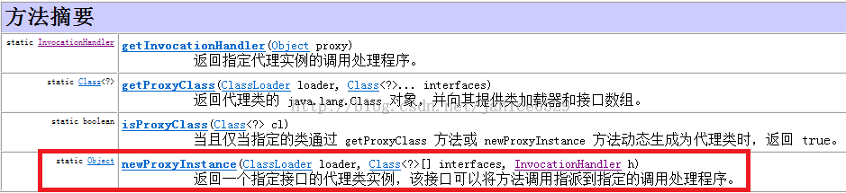

# Java反射
Java反射提供了获取运行时类的内部结构。constructor、method、field。

一个反射调用的简单例子：
```
  class MyClass {
      public int count;

      public MyClass(int count) {
          this.count = count;
      }

      public void increase(int step) {
          count = count + step;
      }
  }
// 一般做法,构造实例
        MyClass myClass = new MyClass(0);
        myClass.increase(2);
        System.out.println(myClass.count);

        // 不一般的做法,反射
        try {
            //获取构造函数
            Constructor<MyClass> constructor = MyClass.class.getConstructor(int.class);
            //创建对象
            MyClass myClassReflect = constructor.newInstance(10);
            //获取方法
            Method method = MyClass.class.getMethod("increase", int.class);
//            method.setAccessible(true); //设置可访问状态
            //调用方法
            method.invoke(myClassReflect, 5);
            //获取域
            Field field = MyClass.class.getField("count");
            //获取值
            System.out.println("Reflect -> " + field.getInt(myClassReflect));
        } catch (NoSuchMethodException e) {
            e.printStackTrace();
        } catch (InstantiationException | IllegalAccessException | IllegalArgumentException | InvocationTargetException e) {
            e.printStackTrace();
        } catch (NoSuchFieldException e) {
            e.printStackTrace();
        }
```
处理数组：
```
//2.处理数组
        Object array = Array.newInstance(String.class, 10);// 等价于new String[10]
        Array.set(array, 0, "hello"); // 等价于array[0] = "hello"
        Array.set(array, 1, "world"); // 等价于array[1] = "world"
        System.out.println(Array.get(array, 0)); //等价于 array[0
```
反射时的泛型处理：    
Java 5中引入了泛型的概念之后,Java反射API也做了相应的修改,以提供对泛型的支持.由于类型擦除机制的存在,泛型类中的类型参数等信息,在运行时
是不存在的.JVM看到的都是原始类型.对此,Java5对Java类文件格式做了修订,添加了Signature属性,用来包含不在JVM类型系统的类型信息.
比如以java.util.List接口为例,在其类文件中的Signature属性的声明是
                                          `<E:Ljava/lang/Object;>Ljava/lang/Object;Ljava/util/Collection<TE;>;;`,
这就说明List接口有一个类型参数E.在运行时刻,JVM就会读取Signature属性的内容并提供给反射API来使用.

```
    /**
     * java.lang.reflect.Type：java语言中所有类型的公共父接口
     * Type 有四个子接口: ParameterizedType, TypeVariable, WildcardType, GenericArrayType
     */

     // 测试Type的四个子接口
    class GenericTest<T1, T2 extends Number> {
        // test
        private Map<T1, Integer> map = null;
        private Map<? extends Number, ? super Integer> wildMap;
        private T1[] array = null;
    }

     // 1. ParameterizedType 表示泛型类型,比如Map<T1, T2> 或者List<T>, getActualTypeArguments获取泛型类型T1, T2
         public static void testParameterizedType() {
             Field field = null;
             try {
                 field = GenericTest.class.getDeclaredField("map"); //获取map属性
             } catch (NoSuchFieldException e) {
                 e.printStackTrace();
             }

             Type mapGenericType = field.getGenericType(); // ParameterizedType

             if (mapGenericType instanceof ParameterizedType) { // 该类型是 泛型类型
                 Type basicType = (ParameterizedType) mapGenericType;
                 System.out.println("basicType equals Map.class is " + (basicType == Map.class));
                 System.out.println("基本类型为: " + basicType);
                 // 获取泛型类型参数Map<T1, T2> 中的T1, T2
                 Type[] types = ((ParameterizedType) basicType).getActualTypeArguments();
                 for (int i = 0; i < types.length; i++) {
                     System.out.printf("第 %d 个参数是 %s \n", i + 1, types[i].getTypeName()); // 输出分别为 T1, class java.lang.Integer
                 }
                 System.out.println(((ParameterizedType) basicType).getOwnerType()); // null
             }
         }     

         // 2. TypeVariable 泛型参数类型,即Map<T1, Integer> 中的T1即为泛型参数类型,而Integer则不是
         public static void testTypeVariable() {
             Field field = null;
             try {
                 field = GenericTest.class.getDeclaredField("map");
             } catch (NoSuchFieldException e) {
                 e.printStackTrace();
             }

             Type basicType = field.getGenericType(); // ParameterizedType

             if (basicType instanceof ParameterizedType) {
                 ParameterizedType type = (ParameterizedType) basicType;
                 Type[] types = type.getActualTypeArguments(); // 获取参数泛型
                 for (int i = 0; i < types.length; i++) {
                     Type t = types[i];
                     if (t instanceof TypeVariable) {
                         // T1 是 TypeVariable , 而Integer 不是
                         System.out.printf("the %dth %s is TypeVariable \n", i + 1, t.getTypeName());
                     } else {
                         System.out.printf("the %dth %s is not TypeVariable \n", i + 1, t.getTypeName());
                     }
                 }
             }
         }

    // 3. WildcardType 是通配符类型, 也即是 ? extends Number 这种.可以获得上下界限.
    public static void testWildcardType() {
        Field field = null;
        try {
            field = GenericTest.class.getDeclaredField("wildMap");
        } catch (NoSuchFieldException e) {
            e.printStackTrace();
        }

        Type mapGenericType = field.getGenericType(); //
        TypeVariable<Class<GenericTest>>[] typeVariables = GenericTest.class.getTypeParameters(); //
        System.out.println("typeVariable's length is " + typeVariables.length);
        Type[] types = ((ParameterizedType) mapGenericType).getActualTypeArguments();
        for (Type t : types) {
            if (t instanceof WildcardType) {
                System.out.printf("%s is wildcardType \n", t.getTypeName());
                if (((WildcardType) t).getLowerBounds().length > 0) {
                    System.out.printf("the lower bound type is %s \n", ((WildcardType) t).getLowerBounds()[0].getTypeName()); // java.lang.Integer
                }
                if (((WildcardType) t).getUpperBounds().length > 0) {
                    System.out.printf("the upper bound type is %s \n", ((WildcardType) t).getUpperBounds()[0].getTypeName()); // java.lang.Number
                }
            }
        }
    }

    // 4. GenericArrayType 数组泛型
    public static void testGenericArrayType() {
        Field arrayField = null;
        try {
            arrayField = GenericTest.class.getDeclaredField("array");
        } catch (NoSuchFieldException e) {
            e.printStackTrace();
        }

        Type arrayGenericType = arrayField.getGenericType();
        if (arrayGenericType instanceof GenericArrayType) {
            System.out.println("is GenericArrayType...");  // is GenericArrayType...
            Type t1 = ((GenericArrayType) arrayGenericType).getGenericComponentType();
            System.out.printf("array componentType is %s \n", t1.getTypeName()); // array componentType is T1
            if (t1 instanceof TypeVariable) {
                System.out.printf("%s is TypeVariable. \n", t1.getTypeName()); // T1 is TypeVariable.
                System.out.printf("%s \n", ((TypeVariable) t1).getGenericDeclaration());
            }
        }
    }

```
# JDK动态代理
JDK动态代理中重要的一个接口 InvocationHandler 和一个类 Proxy。

1. InvocationHandler 接口     
     public interface InvocationHandler {
                               被代理的对象    被代理的方法实例 方法参数
          public static invoke(Object proxy, Method method, Object[] args) throws Throwable;
     }
2. Proxy类

返回代理实例的方法
                                类加载器             被代理的类的全部接口      InvocationHandler实例
static Object newProxyInstance(ClassLoader loader, Class<?>[] interfaces, InvocationHandler h);

```
// 接口
interface Subject {
    void visit();
}

// 被代理类
class RealSubject implements Subject {
    @Override
    public void visit() {
        System.out.println("I'm a RealSubject, I'm the execution method...");
    }
}

// JDK动态代理类
class DynamicProxy implements InvocationHandler {
    private Object subject;

    public DynamicProxy(Object subject) {
        this.subject = subject;
    }

    @Override
    public Object invoke(Object proxy, Method method, Object[] args) throws Throwable {
        System.out.println("before the proxy invoke...");
        method.invoke(subject, args);
        System.out.println("after the proxy invoke...");
        return null;
    }
}

// 测试代理
public static void main(String[] args) {
        // 要代理的真实对象
        Subject realSubject = new RealSubject();
        // 要代理哪个对象,就将哪个对象穿进去
        InvocationHandler handler = new DynamicProxy(realSubject);
        /**
         * 通过Proxy的newProxyInstance 方法来动态创建我们的代理对象, 三个参数如下:
         * 参数一: 这里使用Handler这个类的ClassLoader对象来加载我们的代理对象
         * 参数二: 这里为代理对象提供的接口是真实对象所实现的接口,表示我们要代理的是该真实对象,这样我就能调用这组接口中的方法了
         * 参数三: 我们这里将代理对象设置为上方的InvocationHandler 实例.
         */
        Subject subjectProxyInstance = (Subject) Proxy.newProxyInstance(handler.getClass().getClassLoader(),
                RealSubject.class.getInterfaces(),
                handler);

        System.out.println(subjectProxyInstance.getClass().getName()); // proxy.$Proxy0

        subjectProxyInstance.visit();
    }
```
# CGLIB 动态代理
CGLIB 是一个优秀的动态代理框架，它的底层使用ASM(JAVA 字节码处理框架) 在内存中动态的生成被代理类的子类。使用CGLIB即使被代理的类没有实现任何接口也可以实现动态代理功能。但是不能对final修饰的类进行代理。

CGLIB的原理是通过字节码增强技术为一个类创建子类，并在子类中采用方法拦截的技术拦截所有父类方法的调用。<JDK动态代理与CGLIB动态代理都是实现Spring AOP的基础>。

使用CGLIB前需要带入一下两个jar文件：    
asm.jar -CGLIB 的底层实现。 【CGLIB包的底层是使用字节码处理框架ASM来转换字节码并生成新的类，所以CGLIB包要依赖于ASM包】     
cglib.jar -CGLIB的核心包。
