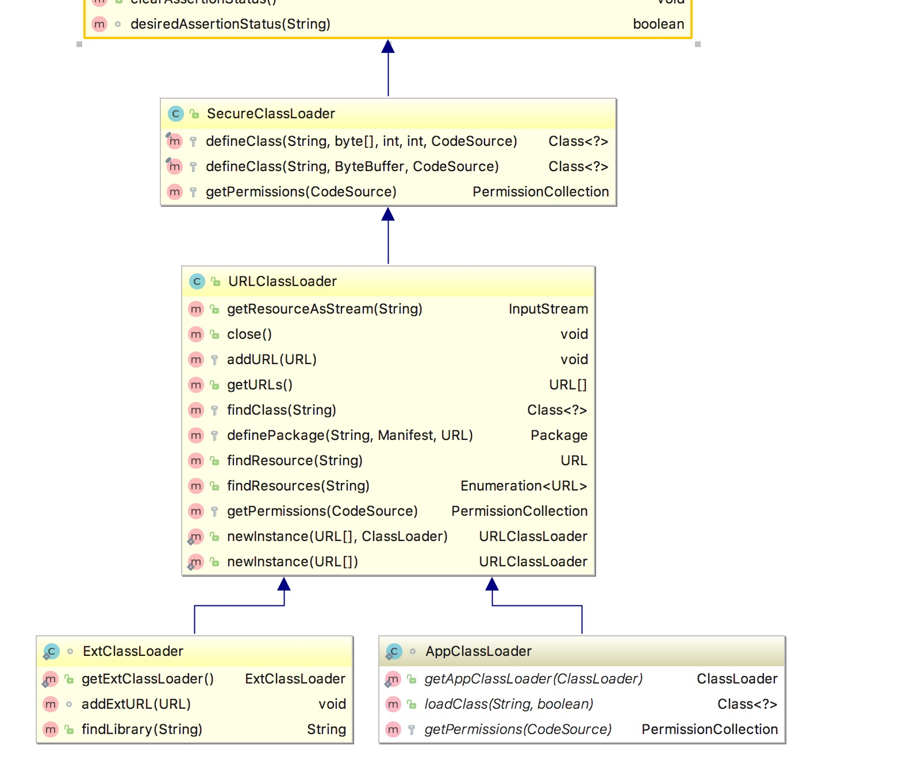

# JVM 类加载过程
如图（图片来自[http://www.importnew.com/25295.html](http://www.importnew.com/25295.html)），类从被加载至虚拟机内存中开始，到卸载为止，共有七个阶段：加载(Loading)、验证(Verification)、准备(Preparation)、解析(Resolution)、初始化(Initialization)、使用(Using)、卸载(Unloading)。

其中，加载(Loading)、验证(Verification)、准备(Preparation)、解析(Resolution)、初始化(Initialization)五个阶段为其加载过程。在这五个阶段中，加载、验证、准备、初始化的顺序是确定的。


# 加载(Loading)
加载是类加载的第一个阶段，在这个阶段，虚拟机需要完成一下三件事：

1. 通过一个类的全限定名来获取一个类的字节流。
2. 将这个字节流所代表的的静态存储结构转换为JVM方法区的运行时数据结构。
3. 在JVM堆中生成一个代表这个类的`java.lang.Class`对象，作为对方法区中这些数据的访问入口。

**注：** 第一步中获取一个类的字节流并不单单可以从Class文件中获取，还可以从网络中获取（Applet）、从Jar包中获取、从其他文件生成（Jsp）等。

# 验证(Verification)
验证的目的是确保Class文件中的字节流信息符合当前虚拟机的规范，而不会危害虚拟机的安全。验证大致分为四个阶段：

1. 文件格式的验证：验证字节流是否符合Class文件格式的规范，并能被当前版本的虚拟机处理，该验证的目的是保证输入的字节流能正确的解析并存储于方法区之内。经过该阶段的验证后，字节流才会进入方法区进行存储，后面的验证都是基于方法区内的存储结构进行验证。
2. 元数据验证：对类的元数据进行语义校验，确保不存在不符合Java语法规范的元数据信息。
3. 字节码验证：主要工作是对数据流和控制流进行分析，对类的方法体进行校验分析，确保类的方法在运行时不会做出危害虚拟机安全的操作。
4. 符号引用验证：发生在将符号引用转换为直接引用的过程中，对类自身以外的引用信息（常量池中的各种符号引用），进行匹配性校验。

# 准备（Preparation）
准备阶段是正式为类变量分配内存并设置初始值的阶段，这些内存都在方法区中分配。

1. 此时只会为类变量分配内存，而成员变量（实例变量）会在对象实例化时随着对象一块分配在Java堆中。
2. 这里所设置的默认值是数据类型默认的零值，而不是代码设置的值。
假设定义一个类变量： `public static int value = 3;`，在准备阶段，`value`的值是`0`。

# 解析（Resolution）
解析阶段是虚拟机将常量池中的符号引用转化为直接引用的过程。

常量池中主要存放两大类常量：字面量和符号引用。字面量比较接近于Java层面的常量概念，如文本字符串、被声明为final的常量值等。而符号引用总结起来则包括了下面三类常量：

类和接口的全限定名（即带有包名的Class名，如：org.lxh.test.TestClass）
字段的名称和描述符（private、static等描述符）
方法的名称和描述符（private、static等描述符）
    虚拟机在加载Class文件时才会进行动态连接，也就是说，Class文件中不会保存各个方法和字段的最终内存布局信息，因此，这些字段和方法的符号引用不经过转换是无法直接被虚拟机使用的。当虚拟机运行时，需要从常量池中获得对应的符号引用，再在类加载过程中的解析阶段将其替换为直接引用，并翻译到具体的内存地址中。

    这里说明下符号引用和直接引用的区别与关联：

符号引用：符号引用以一组符号来描述所引用的目标，符号可以是任何形式的字面量，只要使用时能无歧义地定位到目标即可。符号引用与虚拟机实现的内存布局无关，引用的目标并不一定已经加载到了内存中。
直接引用：直接引用可以是直接指向目标的指针、相对偏移量或是一个能间接定位到目标的句柄。直接引用是与虚拟机实现的内存布局相关的，同一个符号引用在不同虚拟机实例上翻译出来的直接引用一般不会相同。如果有了直接引用，那说明引用的目标必定已经存在于内存之中了。

# 初始化（Initialization）
初始化时类加载的最后一步，该阶段会真正开始执行类中定义的Java代码（`clint`方法）：    
1. <clinit>（）方法是由编译器自动收集类中的所有类变量的赋值动作和静态语句块中的语句合并产生的，编译器收集的顺序是由语句在源文件中出现的顺序所决定的，静态语句块中只能访问到定义在静态语句块之前的变量，定义在它之后的变量，在前面的静态语句中可以赋值，但是不能访问。
2. <clinit>（）方法与实例构造器<init>（）方法（类的构造函数）不同，它不需要显式地调用父类构造器，虚拟机会保证在子类的<clinit>（）方法执行之前，父类的<clinit>（）方法已经执行完毕。因此，在虚拟机中第一个被执行的<clinit>（）方法的类肯定是java.lang.Object。
3. <clinit>（）方法对于类或接口来说并不是必须的，如果一个类中没有静态语句块，也没有对类变量的赋值操作，那么编译器可以不为这个类生成<clinit>（）方法。
4. 虚拟机会保证一个类的<clinit>（）方法在多线程环境中被正确地加锁和同步，如果多个线程同时去初始化一个类，那么只会有一个线程去执行这个类的<clinit>（）方法，其他线程都需要阻塞等待，直到活动线程执行<clinit>（）方法完毕。如果在一个类的<clinit>（）方法中有耗时很长的操作，那就可能造成多个线程阻塞，在实际应用中这种阻塞往往是很隐蔽的。

# 类加载器（ClassLoader）
在JVM中，一个类的唯一性由加载该类的类加载器与类本身决定。即 即使同一个类，由不同的类加载器加载，那么在JVM中，它也是不相等的。这里的相等，包括Class对象的`equals()`、`isAssignableFrom()`、`isInstance()`，也包括使用`instanceof`关键字对对象所属关系的判定结果。

站在Java虚拟机的角度来讲，只存在两种不同的类加载器：

1. 启动类加载器：它使用C++实现（这里仅限于Hotspot，也就是JDK1.5之后默认的虚拟机，有很多其他的虚拟机是用Java语言实现的），是虚拟机自身的一部分。
2. 所有其他的类加载器：这些类加载器都由Java语言实现，独立于虚拟机之外，并且全部继承自抽象类java.lang.ClassLoader，这些类加载器需要由启动类加载器加载到内存中之后才能去加载其他的类。

站在Java开发人员的角度来看，类加载器可以大致划分为以下三类：

1. 启动类加载器：`Bootstrap ClassLoader`，跟上面相同。它负责加载存放在`JDK\jre\lib`(JDK代表JDK的安装目录，下同)下，或被-Xbootclasspath参数指定的路径中的，并且能被虚拟机识别的类库（如rt.jar，所有的java.*开头的类均被Bootstrap ClassLoader加载）。启动类加载器是无法被Java程序直接引用的。
2. 扩展类加载器：`Extension ClassLoader`，该加载器由`sun.misc.Launcher$ExtClassLoader`实现，它负责加载`JDK\jre\lib\ext`目录中，或者由java.ext.dirs系统变量指定的路径中的所有类库（如javax.*开头的类），开发者可以直接使用扩展类加载器。
3. 应用程序类加载器：Application ClassLoader，该类加载器由`sun.misc.Launcher$AppClassLoader`来实现，它负责加载用户类路径（ClassPath）所指定的类，开发者可以直接使用该类加载器，如果应用程序中没有自定义过自己的类加载器，一般情况下这个就是程序中默认的类加载器。

以上几种类加载器的层次关系如下：


这种层次关系，称为类加载器的双亲委派模型。我们把每一层上面的类加载器叫做当前层类加载器的父加载器，当然，它们之间的父子关系并不是通过继承关系来实现的，而是使用组合关系来复用父加载器中的代码。该模型在JDK1.2期间被引入并广泛应用于之后几乎所有的Java程序中，但它并不是一个强制性的约束模型，而是Java设计者们推荐给开发者的一种类的加载器实现方式。

双亲委派模型的工作流程是：如果一个类加载器收到了类加载的请求，它首先不会自己去尝试加载这个类，而是把请求委托给父加载器去完成，依次向上，因此，所有的类加载请求最终都应该被传递到顶层的启动类加载器中，只有当父加载器在它的搜索范围中没有找到所需的类时，即无法完成该加载，子加载器才会尝试自己去加载该类。

使用双亲委派模型来组织类加载器之间的关系，有一个很明显的好处，**就是Java类随着它的类加载器（说白了，就是它所在的目录）一起具备了一种带有优先级的层次关系，这对于保证Java程序的稳定运作很重要**。例如，类java.lang.Object类存放在JDK\jre\lib下的rt.jar之中，因此无论是哪个类加载器要加载此类，最终都会委派给启动类加载器进行加载，这边保证了Object类在程序中的各种类加载器中都是同一个类。这样可以防止恶意篡改系统核心API库，也保证了JVM类系统的安全。

# 实现自己的类加载器（自定义类加载器）
在`Java`类加载机制中最上层的类是`java.lang.ClassLoader`，定义了类加载的框架，所有其他`ClassLoader`都继承于它（不包括`Bootstrap ClassLoader`）。`ClassLoader`中大部分方法都已经有默认实现，我们定制自己的类加载器时，只要关注几个方法：

* `loadClass(String)`

该方法加载指定名称（包括包名）的二进制类型，该方法在JDK1.2之后不再建议用户重写但用户可以直接调用该方法，`loadClass()`方法是`ClassLoader`类自己实现的，该方法中的逻辑就是双亲委派模式的实现，`loadClass(String name, boolean resolve)`是一个重载方法，resolve参数代表是否生成class对象的同时进行解析相关操作。源码如下（jdk1.8）：

```java
    /**
     * Loads the class with the specified <a href="#name">binary name</a>.
     * This method searches for classes in the same manner as the {@link
     * #loadClass(String, boolean)} method.  It is invoked by the Java virtual
     * machine to resolve class references.  Invoking this method is equivalent
     * to invoking {@link #loadClass(String, boolean) <tt>loadClass(name,
     * false)</tt>}.
     *
     * @param  name
     *         The <a href="#name">binary name</a> of the class
     *
     * @return  The resulting <tt>Class</tt> object
     *
     * @throws  ClassNotFoundException
     *          If the class was not found
     */
    public Class<?> loadClass(String name) throws ClassNotFoundException {
        return loadClass(name, false);
    }

    protected Class<?> loadClass(String name, boolean resolve)
        throws ClassNotFoundException
    {
        synchronized (getClassLoadingLock(name)) {
            // First, check if the class has already been loaded
            Class<?> c = findLoadedClass(name);
            if (c == null) {
                long t0 = System.nanoTime();
                try {
                    if (parent != null) {
                        c = parent.loadClass(name, false);
                    } else {
                        c = findBootstrapClassOrNull(name);
                    }
                } catch (ClassNotFoundException e) {
                    // ClassNotFoundException thrown if class not found
                    // from the non-null parent class loader
                }

                if (c == null) {
                    // If still not found, then invoke findClass in order
                    // to find the class.
                    long t1 = System.nanoTime();
                    c = findClass(name);

                    // this is the defining class loader; record the stats
                    sun.misc.PerfCounter.getParentDelegationTime().addTime(t1 - t0);
                    sun.misc.PerfCounter.getFindClassTime().addElapsedTimeFrom(t1);
                    sun.misc.PerfCounter.getFindClasses().increment();
                }
            }
            if (resolve) {
                resolveClass(c);
            }
            return c;
        }
    }
```

* `findClass(String) `

在JDK1.2之前，在自定义类加载时，总会去继承ClassLoader类并重写loadClass方法，从而实现自定义的类加载类，但是在JDK1.2之后已不再建议用户去覆盖loadClass()方法，而是建议把自定义的类加载逻辑写在findClass()方法中，从前面的分析可知，findClass()方法是在loadClass()方法中被调用的，当loadClass()方法中父加载器加载失败后，则会调用自己的findClass()方法来完成类加载，这样就可以保证自定义的类加载器也符合双亲委托模式。需要注意的是ClassLoader类中并没有实现findClass()方法的具体代码逻辑，取而代之的是抛出ClassNotFoundException异常。

```java
protected Class<?> findClass(String name) throws ClassNotFoundException {
    throw new ClassNotFoundException(name);
}
```

* `defineClass(String name, byte[] b, int off, int len,ProtectionDomain protectionDomain)`

```java
protected final Class<?> defineClass(String name, byte[] b, int off, int len,
                                         ProtectionDomain protectionDomain)
    throws ClassFormatError
{
    protectionDomain = preDefineClass(name, protectionDomain);
    String source = defineClassSourceLocation(protectionDomain);
    Class<?> c = defineClass1(name, b, off, len, protectionDomain, source);
    postDefineClass(c, protectionDomain);
    return c;
}
```

defineClass()方法是用来将byte字节流解析成JVM能够识别的Class对象(ClassLoader中已实现该方法逻辑)，通过这个方法不仅能够通过class文件实例化class对象，也可以通过其他方式实例化class对象，如通过网络接收一个类的字节码，然后转换为byte字节流创建对应的Class对象，defineClass()方法通常与findClass()方法一起使用，一般情况下，在自定义类加载器时，会直接覆盖ClassLoader的findClass()方法并编写加载规则，取得要加载类的字节码后转换成流，然后调用defineClass()方法生成类的Class对象，简单例子如下：

```java
protected Class<?> findClass(String name) throws ClassNotFoundException {
      // 获取类的字节数组
    byte[] classData = getClassData(name);  
    if (classData == null) {
        throw new ClassNotFoundException();
    } else {
        //使用defineClass生成class对象
        return defineClass(name, classData, 0, classData.length);
    }
}
```

* `resolveClass(Class≺?≻ c) `

解析`Class`对象，将符号引用转化为直接引用。


# `URLClassLoader`


上述4个方法是ClassLoader类中的比较重要的方法，也是我们可能会经常用到的方法。接看SercureClassLoader扩展了 ClassLoader，新增了几个与使用相关的代码源(对代码源的位置及其证书的验证)和权限定义类验证(主要指对class源码的访问权限)的方法，一般我们不会直接跟这个类打交道，更多是与它的子类URLClassLoader有所关联，前面说过，ClassLoader是一个抽象类，很多方法是空的没有实现，比如 findClass()、findResource()等。而URLClassLoader这个实现类为这些方法提供了具体的实现，并新增了URLClassPath类协助取得Class字节码流等功能，在编写自定义类加载器时，如果没有太过于复杂的需求，可以直接继承URLClassLoader类，这样就可以避免自己去编写findClass()方法及其获取字节码流的方式，使自定义类加载器编写更加简洁。


# 参考
(《深入理解Java虚拟机》-周志明)[https://book.douban.com/subject/24722612/]

http://blog.csdn.net/ns_code/article/details/17881581#insertcode

http://www.importnew.com/25295.html

http://blog.csdn.net/javazejian/article/details/73413292#%E7%B3%BB%E7%BB%9Fsystem%E7%B1%BB%E5%8A%A0%E8%BD%BD%E5%99%A8