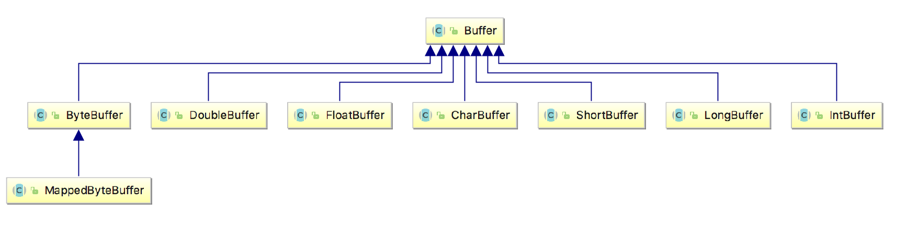
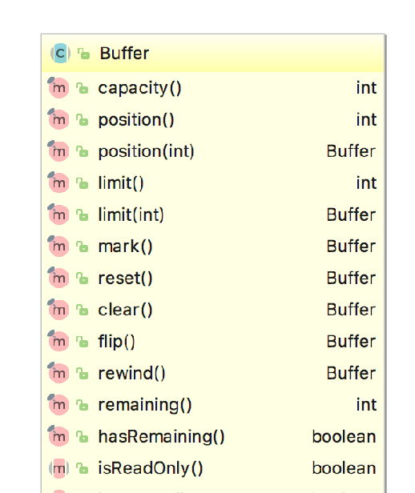

# 简介
Buffer本质是一块内存区域，被Buffer封装起来，对外提供读写的接口。

# 基本属性

## 容量（Capacity）
缓冲区能够容纳数据的最大容量，在创建时被指定，并且不可更改。

## 位置（Position）
读取/写入数据的位置标识。   
在写模式下，Position默认初始化的位置时0，每写入一个数据，Position的位置就会向后移动一个单元。Position位置最大为（Capacity - 1）。     
在从写模式转换到读模式下，Position位置会被置零，每读取一个数据Position向后移动一个位置。最大为（Limit - 1）。

## 上界（Limit）
缓冲区第一个不能被读或写的元素。    
在写模式，Limit为最大写入数据容量，等同于Capacity。   
从写模式切换到读模式，Limit的值为能读取的最大数据容量。与写模式下的Position相等。

## 标记（Mark）
一个备忘位置。调用`mark()`来设定`mark = position`，调用`reset()`来设置`position = mark`。mark在设定前是未定义的。   

这四个属性总是遵循以下关系：    
`0 <= mark <= position <= limit <= capacity`

# Buffer基本用法
使用Buffer读写数据，通常遵循四个步骤：   
* 把数据写入Buffer
* 调用flip
* 从Buffer中读取数据 
* 调用Buffer.clear()或Buffer.compact()

当数据写入Buffer过后，调用`flip`转换为读模式。在读模式下，可以读取所有已写入的数据。  
当读完数据后，需要清空Buffer，以进行后续的写入操作。可以调用`clear()`方法或`compact()`方法。`clear`会清空整个Buffer，`compact`只会清空已读的数据，未读的数据会被移动到Buffer的开始位置，写入位置则紧跟着未读书之后。

```java
// 1. 创建Buffer
ByteBuffer buf = ByteBuffer.allocate(48);  // 创建一个48字节的ByteBuffer
// CharBuffer buf = CharBuffer.allocate(1024);  // 创建一个1024个字符的CharBuffer

// 2. 读取数据到Buffer
int bytesRead = inChannel.read(buf);  // 从channel读取数据到buffer
buf.put(127);  // 使用put写入数据到buffer

// 3. flip翻转，转换到写模式，limit置为读模式下的position位置， position置零
buf.flip();

// 4. 读取buffer中的数据写入到channel(即外部数据源)
int bytesWrite = inChannel.write(buf);
byte b = buf.get(); //调用get获取数据
```

* `rewind()` 方法将position置为0，limit不变，这样我们可以重复读Buffer中的数据。     
* `clear()` 当读取完所需要的数据后，需要复用buffer为下次写入数据做准备，调用clear清除所有数据，position置零，limit置为capacity，mark置为-1。   
* `compact()` 同样为清理数据，compact(压缩)会保留未读数据。
* `mark()/reset()`mark操作将mark=position，reset操作position=mark。
* `equals()` 需满足：类型相同，未读元素数相同，未读元素相同。

# Buffer 家谱


# Buffer API


