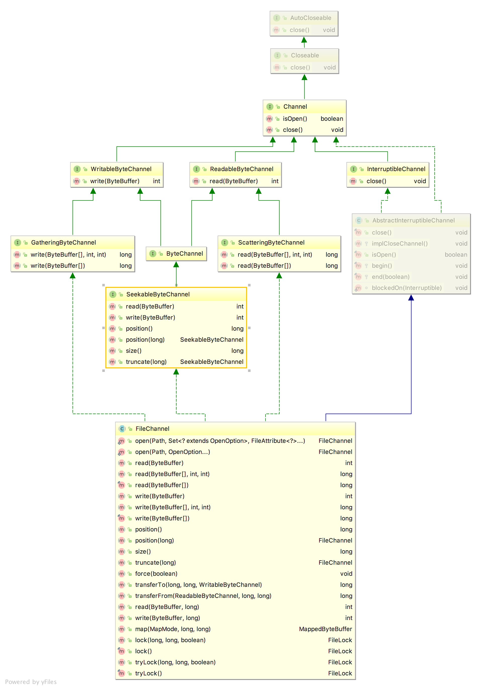
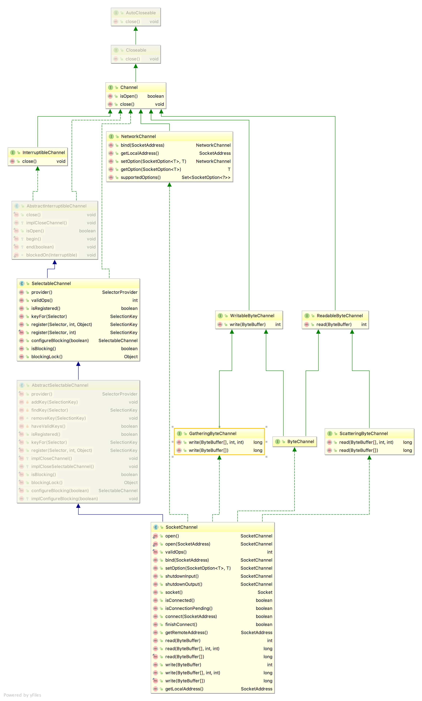

# 简介
通道是访问I/O服务的导管，通道分为两大类。即文件通道，套接字通道。   
* 文件通道：   
    * FileChannel
* 套接字通道：
    * SocketChannel
    * ServerSockerChannel
    * DatagramChannel

`FileChannel`用于文件的读写；`DatagramChannel`用于UDP数据的读写；`SocketChannel`用于TCP数据的读写；`ServerSocketChannel`用于监听套接字请求，每个请求创建一个`SocketChannel`。

# 打开通道

`FileChannel`只能通过一个打开的`RandomAccessFile`、`FileInputStream`、`FileOutStream` 上调用`getChannel`方法来获取。不能直接创建`FileChannel`对象。

```java
RandomAccessFile raf = new RandomAccessFile("test.txt", "rw");
FileChannel fileChannel = raf.getChannel();

FileInputStream fis = new FileInputStream("test.txt");
FileChannel fileChannel1 = fis.getChannel();

FileOutputStream fos = new FileOutputStream("test.txt");
FileChannel fileChannel2 = fos.getChannel();
```

```java
// 创建ServerSocketChannel可以使用ServerSocketChannel的工厂方法
ServerSocketChannel serverSocketChannel = ServerSocketChannel.open();
serverSocketChannel.bind(new InetSocketAddress("localhost", 8888));

// 创建SocketChannel
SocketChannel socketChannel = SocketChannel.open();
socketChannel.connect(new InetSocketAddress("localhost", 8888));

// 创建DatagramChannel
DatagramChannel datagramChannel = DatagramChannel.open();
```

# 使用通道

FileChannel UML:   
     

SocketChannel UML:     


一次使用FileChannel读取中文文件`nio-data.txt`的实例：   
```java
public static void main(String[] args) throws IOException {

    // 1. 创建channel
    RandomAccessFile raf = new RandomAccessFile(new File("nio-data.txt"), "rw");
    FileChannel channel = raf.getChannel();

    Charset charset = Charset.forName("utf-8");
    CharsetDecoder decoder = charset.newDecoder();

    // 2. 创建buffer
    ByteBuffer buffer = ByteBuffer.allocate(512);
    CharBuffer cb = CharBuffer.allocate(512);

    // 3. channel从文件中读取数据到内存buffer中
    int bytesRead = channel.read(buffer);

    while (bytesRead != -1) {  // 当有数据读到时
        System.out.println("read bytes: " + bytesRead);
        buffer.flip();  // buffer转换为可读模式
        decoder.decode(buffer, cb, false);  // 解码到CharBuffer中
        cb.flip();

        while (cb.hasRemaining()) { // buffer中还有剩余数据
            System.out.print(cb.get());
        }

        buffer.clear(); // 清空数据（重置position、limit位置）
        cb.clear();

        bytesRead = channel.read(buffer);
    }

    raf.close();
}
```


**注：**
在打开一个文件时，往往会设置打开的模式（权限），一个`FileInputStream`打开的文件是只读的，因此，`getChannel`获得的`Channel`对象也是只读的，但是从`FileChannel`的API上来看却是双向的，因为`FileChnanel`实现了`ByteChannel`接口。在这样的通道上调用`write()`方法会抛出未经检查异常`NonWritableChannelException`，因为`FileInputStream`总是以`read-only`权限打开文件。    

**通道会链接一个特点的I/O服务，且通道实例(channel instance)性能受到该特定I/O服务的特征所限制。如，一个链接到只读文件的FileChannel不能进行写操作，所以我们最好知道通道是如何打开的，避免试图进行一个底层IO不允许的操作。**


