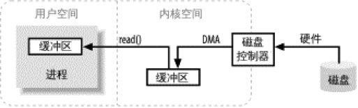

# 缓冲区操作
在计算机中，缓冲区，以及缓冲区如何工作，是所有I/O的基础。所谓“输入/输出”，讲的无非就是把数据移入，移除缓冲区。     
进程执行I/O操作，就是向操作系统发出请求，让它要么把缓冲区的数据排干（写），要么把缓冲区的数据填满（读）。  

下图简单描述了数据从外部磁盘移动至运行中的进程缓冲区的过程。进程使用`read()`系统调用请求其缓冲区被填满。内核随机向磁盘控制器发出指令，要求其从磁盘读取数据。磁盘控制器随机将磁盘数据读入内核内存缓冲区，这一步通过DMA操作，无需CPU协助。一旦磁盘控制器把缓冲区填满，内核即把数据从内核缓冲区拷贝到进程`read()`调用指定的缓冲区。

# 虚拟内存
现代操作系统都使用虚拟内存，虚拟内存就是使用虚拟地址取代物理内存地址。这样做有很多好处，总结起来可分为两大类：
1. 一个以上的虚拟地址（比如内核缓冲区与进程缓冲区）可直接映射到同一个物理地址。
2. 虚拟地址空间可大于实际的硬件内存。

# 文件I/O
采用分页技术的操作系统执行I/O的全过程可总结为以下几步:  
• 确定请求的数据分布在文件系统的哪些页(磁盘扇区组)。磁盘上的文件内容和元数 据可能跨越多个文件系统页，而且这些页可能也不连续。  
• 在内核空间分配足够数量的内存页，以容纳得到确定的文件系统页。
17   
• 在内存页与磁盘上的文件系统页之间建立映射。  
• 为每一个内存页产生页错误。  
• 虚拟内存系统俘获页错误，安排页面调入，从磁盘上读取页内容，使页有效。  
• 一旦页面调入操作完成，文件系统即对原始数据进行解析，取得所需文件内容或属性
信息。

# 流I/O
并非所有I/O都像前几节讲的是面向块的，也有流I/O，其原理模仿了通道。I/O字节流必须顺序
存取，常见的例子有TTY(控制台)设备、打印机端口和网络连接。
流的传输一般(也不必然如此)比块设备慢，经常用于间歇性输入。多数操作系统允许把流置 于非阻塞模式，这样，进程可以查看流上是否有输入，即便当时没有也不影响它干别的。这样一种 能力使得进程可以在有输入的时候进行处理，输入流闲置的时候执行其他功能。
  比非阻塞模式再进一步，就是就绪性选择。就绪性选择与非阻塞模式类似(常常就是建立在非
阻塞模式之上)，但是把查看流是否就绪的任务交给了操作系统。操作系统受命查看一系列流，并
提醒进程哪些流已经就绪。这样，仅仅凭借操作系统返回的就绪信息，进程就可以使用相同代码和
单一线程，实现多活动流的多路传输。这一技术广泛用于网络服务器领域，用来处理数量庞大的网
络连接。就绪性选择在大容量缩放方面是必不可少的。
